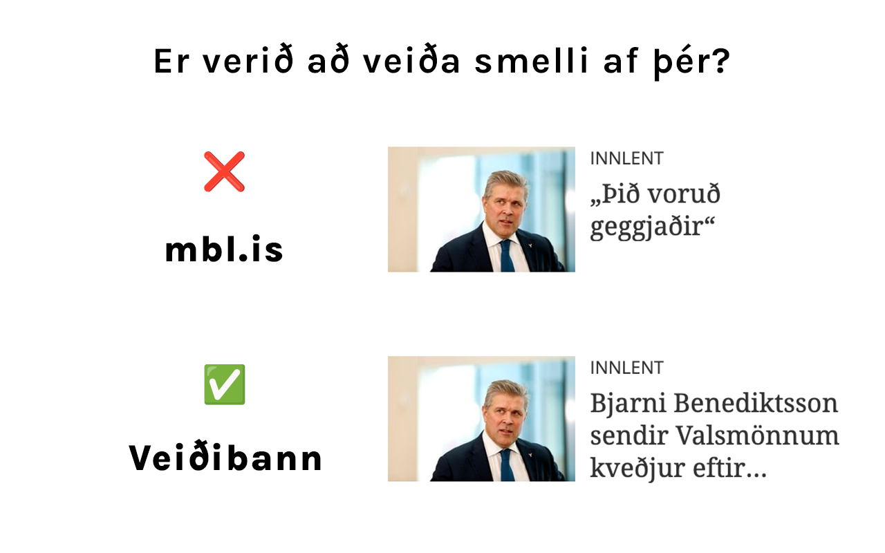

# Veiðibann

Finnst þér fyrirsagnirnar á mbl.is óskýrar og bara til þess gerðar að fá þig til að smella á þær? Veiðibann skiptir óskýrum fyrirsögnum út á forsíðunni og gerir þér kleyft að taka upplýsta ákvörðun áður en þú smellir á fréttina.

## Hvernig virkar þetta?

Verkefnið notar [Cloudflare Workers (vinnumenn)](https://workers.cloudflare.com/) og [GPT-4o frá OpenAI](https://openai.com/index/hello-gpt-4o/) til þess að endurskrifa óskýrar fyrirsagnir. Mjög einföld vafraviðbót (e. browser extension) talar síðan við vinnumanninn, skiptir út fyrisögnunum og vistar fyrirsagnirnar síðan í vafranum til þess að viðbótin þurfi ekki að sækja fyrirsagnir sem hún hefur séð aftur.
